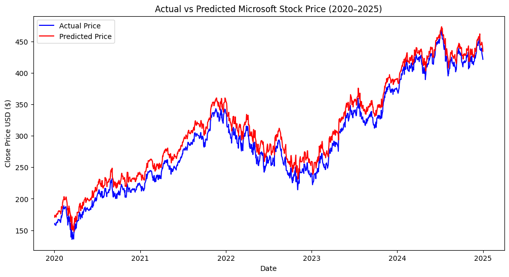

# Predicting Microsoft Stock Values

## Overview

This project aims to predict the stock values of Microsoft using time series analysis techniques. It involves data loading, preprocessing, model building (likely using Keras with a focus on metrics like Root Mean Squared Error), training, and visualization of the results. The code also demonstrates how to filter historical stock data for specific time periods and work with timezones (specifically UTC).

As illustrated below, the project compares the actual Microsoft stock prices with the predicted values over a specific time frame.



## Project Structure

The project consists of the following key components:

-   **`Predicting the Stocks Values of Microsoft.ipynb`**: This Jupyter Notebook contains the complete Python code for the project. It includes steps for:
    -   Loading and exploring the Microsoft stock data.
    -   Preprocessing the data (e.g., converting date formats).
    -   Building and compiling a time series forecasting model (likely using a Recurrent Neural Network like LSTM with Keras).
    -   Training the model on historical data.
    -   Evaluating the model's performance using metrics like Mean Absolute Error (MAE) and Root Mean Squared Error (RMSE).
    -   Making predictions on future stock values (though the provided snippets focus on historical analysis).
    -   Visualizing the historical stock prices and the model's predictions.
    -   Demonstrating how to filter data by date ranges and handle UTC timezones.

## How to Run the Project

1.  **Prerequisites:**
    -   Python 3.x
    -   Jupyter Notebook
    -   Required Python libraries (install using pip):
        ```bash
        pip install pandas matplotlib keras tensorflow pytz
        ```
        You might need to install TensorFlow separately based on your system and GPU availability (e.g., `pip install tensorflow` or `pip install tensorflow-gpu`).

2.  **Save the Image:**
    -   Save the provided image as `actual_vs_predicted.png` in the same directory as your `README.md` file.

3.  **Open the Notebook:**
    -   Navigate to the project directory in your terminal.
    -   Run Jupyter Notebook:
        ```bash
        jupyter notebook
        ```
    -   Open the `Predicting the Stocks Values of Microsoft.ipynb` file in your browser.

4.  **Execute the Code:**
    -   Follow the instructions and execute the cells within the Jupyter Notebook sequentially.
    -   The notebook will guide you through the data loading, preprocessing, model building, training, and visualization steps.

## Key Features Demonstrated

-   **Time Series Data Analysis:** The project showcases techniques for working with time-dependent stock market data.
-   **Data Preprocessing with Pandas:** Demonstrates how to load data into Pandas DataFrames and manipulate date formats.
-   **Model Building with Keras:** Illustrates the process of creating and compiling a neural network model for time series forecasting.
-   **Performance Evaluation:** Uses metrics like Mean Absolute Error (MAE) and Root Mean Squared Error (RMSE) to assess the model's accuracy.
-   **Data Visualization with Matplotlib:** Shows how to plot historical stock prices and the model's predictions.
-   **Date Range Filtering:** Includes code snippets to filter stock data for specific time periods using Pandas.
-   **Timezone Handling (UTC):** Demonstrates how to work with UTC timezones in Pandas for accurate date comparisons and analysis.

## Potential Enhancements

-   **Feature Engineering:** Incorporating additional features (e.g., trading volume, technical indicators) to potentially improve model accuracy.
-   **Model Tuning:** Experimenting with different model architectures, hyperparameters, and optimization algorithms.
-   **More Advanced Forecasting Techniques:** Exploring other time series models like ARIMA, Prophet, or more complex deep learning architectures.
-   **Real-time Data Integration:** Implementing the ability to fetch and predict on the latest stock data.
-   **Deployment:** Deploying the trained model as an API or application for practical use.

## Disclaimer

This project is for educational and demonstrative purposes only. Stock market predictions are inherently uncertain, and the results of this project should not be considered financial advice. Always conduct thorough research and consult with a financial professional before making any investment decisions.
